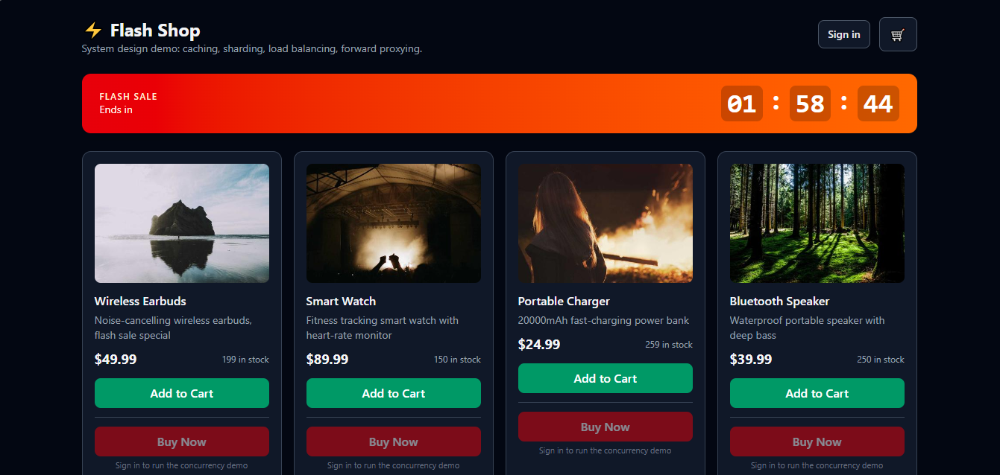
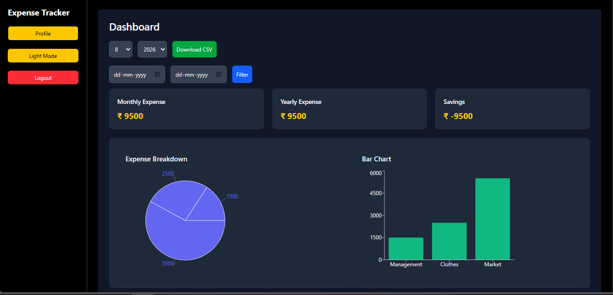
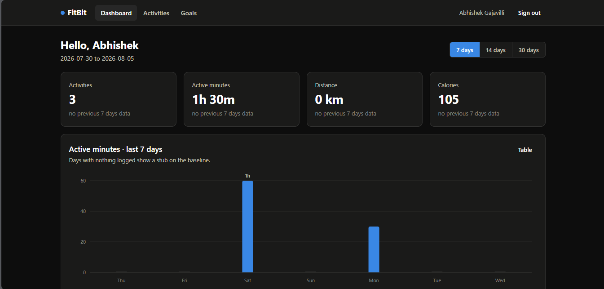

#  ABHISHEK GAJAVILLI 

---

### 🧑‍💻 About Me

- 🔭 I'm currently working as a **Software Developer Engineer**
- 🌱 I'm currently sharpening my skills in **DSA, Full Stack Development & System Design**
- 👯 I'm open to collaborating on interesting **web development** and **open source** projects
- 💬 Ask me about **JavaScript, React, Node.js, or backend development**
- 📫 Reach me at **abhiabhishek9347@gmail.com**
- ⚡ Fun fact: I enjoy solving DSA problems as much as building products

---

# 🌐 Connect With Me

---

# ⚡ Tech Stack

  

<!-- TODO: swap the icon list above for the exact stack you use -->

---

# 🚀 Featured Projects

<!-- TODO: swap the placeholder screenshots for real ones -->

<table>
<tr>

<td width="50%" valign="top">

## ⚡ [Flash-Sale Simulation](https://github.com/Abhishek84313)

> A full-stack e-commerce flash-sale simulation engineered for heavy traffic bursts. An Nginx reverse-proxy load balancer distributes traffic across clustered Spring Boot nodes, while Apache ShardingSphere horizontally partitions high-volume order tables across multiple MySQL shards using hash-based routing.

 

  

</td>

<td width="50%" valign="top">

## 💰 [Expense Tracker](https://github.com/Abhishek84313)

> A full-stack expense management platform with real-time tracking, category analytics and a sleek dashboard. Spring Boot REST API powering a reactive React frontend.

 

  

</td>

</tr>
<tr>

<td colspan="2" align="center" valign="top">

## 🏃 [Fit Bit](https://github.com/Abhishek84313)

> Fitness tracking application built on RESTful services — activity logging, progress metrics and goal tracking wrapped in a clean, responsive interface.

 

  

</td>

</tr>
</table>

---

# 🔥 LeetCode Stats, Badges & Medals

  

### 🎖️ Earned Badges

---

# 🏆 HackerRank Badges & Certifications

  

<!-- TODO: Replace with your actual earned HackerRank skill badges / certificates -->

> 📌 Swap these badges for a screenshot of your real HackerRank badge case at `hackerrank.com/abhi9347/badges` — HackerRank doesn't provide a live badge API, so a pinned image works best.

---

# 📊 GitHub Analytics

 

---

# 🐍 Contribution Snake

> ⚡ This animation is auto-generated from your real commit graph by the `.github/workflows/snake.yml` workflow — it updates itself daily once pushed to GitHub, no manual upkeep needed.

---

<i>Thanks for stopping by! ⭐ this profile if you found it interesting.</i>

